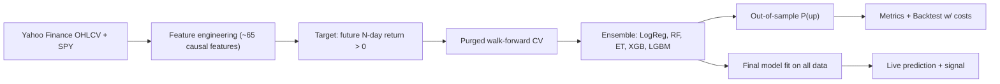

# 📈 Ensemble ML Stock Prediction System

A full, end-to-end machine-learning system that forecasts whether a stock will move **up or down over the next N trading days**. It also tells you **how much to trust that forecast**, using leak-free walk-forward validation and a backtest that includes transaction costs.

> [!WARNING]
> **Educational / research use only. This is not financial advice.** Short-term stock returns are close to random. A model that gets 52–55% direction accuracy out-of-sample is considered *good*. Anything claiming 80–90%+ is almost certainly leaking future data. Don't trade real money on a backtest alone.

---

## ✨ Features

| Area | What you get |
|---|---|
| **Data** | (1) Single-stock OHLCV from Yahoo Finance. (2) **S&P 500 panel data** (~1.7M rows) from Kaggle (`andrewmvd/sp-500-stocks`). |
| **Features** | ~65 **causal** features: momentum, volatility, relative strength, volume z-scores, MACD, RSI, etc., cross-sectionally ranked for the panel. |
| **Models** | Single-stock ensemble (LogReg, RF, ET, XGB, LGBM) or a **global cross-sectional LightGBM** tuned with Optuna. |
| **Validation** | **Expanding-window walk-forward** with a **purge gap = horizon**, ensuring zero look-ahead leak. |
| **Metrics** | Information Coefficient (IC), accuracy, AUC, and decile spreads. |
| **Backtest** | Daily strategy with **transaction costs**, reporting Sharpe, Sortino, Drawdown, Calmar against S&P 500 equal-weight. |
| **Interfaces** | CLI (`train`, `predict`, `panel-train`, `panel-predict`) and an interactive **Streamlit dashboard**. |

---

## 🚀 Quick start

```bash
# 1. Create environment & install
python3 -m venv .venv
source .venv/bin/activate
pip install -r requirements.txt

# 2. Train the full S&P 500 cross-sectional model (downloads ~95MB from Kaggle)
python main.py panel-train --horizon 5

# 3. Predict all 500 stocks using today's live prices from Yahoo
python main.py panel-predict --horizon 5

# Or train a single-stock model
python main.py train --ticker AAPL --horizon 5
```

Indian / international tickers use Yahoo suffixes, e.g. `RELIANCE.NS`, `TCS.NS`, `INFY.NS` with `--market ^NSEI`.

---

## ⚙️ CLI options

| Option | Default | Description |
|---|---|---|
| `--ticker` / `--tickers` | — | Symbol(s) to model |
| `--horizon` | `5` | Predict direction over the next N trading days |
| `--start` / `--end` | `2010-01-01` / today | History window |
| `--market` | `SPY` | Benchmark for context features (`none` to disable) |
| `--models` | `logreg rf et xgb lgbm` | Any subset of base models |
| `--splits` | `8` | Walk-forward folds |
| `--long-threshold` | `0.55` | Go long when P(up) ≥ this |
| `--short-threshold` | `0.45` | Short (if allowed) when P(up) ≤ this |
| `--allow-short` | off | Enable short positions |
| `--sizing` | `binary` | `binary` (all-in/out) or `scaled` (by confidence) |
| `--cost-bps` | `5` | Cost per unit of turnover in basis points |
| `--synthetic` | off | Use generated prices |
| `--no-plots` / `-v` | | Skip charts / verbose logging |

---

## 🧠 How it works



### 1. Panel model (Kaggle S&P 500)
The cross-sectional panel model is the "real-world quant" approach. It trains a single LightGBM model over 500 stocks simultaneously (~1.7M rows).
* **Target:** Predict whether a stock will outperform the median S&P 500 stock over the next `H` days. This strips out market direction.
* **Tuning:** Hyperparameters are tuned via Optuna on a strict validation period.
* **Evaluation:** Evaluated on a strict holdout period using Information Coefficient (IC), decile spreads, and a long/short portfolio backtest.
* **Prediction:** Ranks all 500 stocks from best to worst, giving specific price targets for the top and bottom deciles.

### 2. Single-stock models
For single stocks, it uses a soft-voting ensemble averaging 5 models: Logistic Regression, Random Forest, Extra Trees, XGBoost, and LightGBM.

### 3. No look-ahead, by construction
* Every feature at day *t* is computed only from data up to the close of *t*.
* Walk-forward folds always train on the past and test on the future.
* A **purge gap of H rows** removes training samples whose labels would peek into the test window.

---

## 💾 Model and Report Locations

### Saved Models
Trained models are saved to the `models/` directory:
* **Panel Model:** `models/panel_h<H>.txt` (LightGBM booster) and `models/panel_h<H>_meta.json` (features and metadata).
* **Single Stock:** `models/<TICKER>_h<H>.joblib` (contains the ensemble and configuration).

### Reports & Backtests
Results are saved to `reports/panel_h<H>/` or `reports/<TICKER>_h<H>/`:
* `metrics.json`: All classification, backtest metrics, and IC scores.
* `oos_predictions.parquet` / `.csv`: Out-of-sample predictions.
* `portfolio_backtest.csv`: Positions, strategy returns, equity.
* `feature_importance.png`: Feature importance charts.
* `live_predictions_<DATE>.csv`: Today's ranked predictions for the panel.

---

## 📊 Reading the results

Outputs go to `reports/<TICKER>_h<H>/`:

| File | Contents |
|---|---|
| `metrics.json` | All classification and backtest metrics plus run metadata |
| `oos_predictions.csv` | Per-day out-of-sample probability for every model, label, and returns |
| `backtest.csv` | Positions, strategy returns, equity, drawdown |
| `folds.csv` | Date range and score of each walk-forward fold |
| `feature_importance.csv/.png` | Ensemble-averaged feature importance |
| `equity_curve.png` | Strategy vs buy-and-hold, with drawdown |
| `calibration.png` | Predicted probability vs realized frequency |

**How to judge a model honestly:**
* **AUC > 0.52–0.55** steadily across folds suggests a real (small) edge. An AUC around 0.50 means no edge.
* Compare accuracy with **`baseline_always_up`**. Stocks rise more often than they fall, so a model with 54% accuracy can still be *worse* than always predicting "up".
* Prefer **Sharpe and Max Drawdown** over total return. A strategy that is in the market less often can beat buy-and-hold on risk-adjusted terms while earning less in total.
* Check that fold results are **consistent**. One great fold usually means luck.

---

## 🛠 Extending

* **New features:** add columns in [`build_features`](stock_predictor/features.py). Keep them causal and run `pytest`.
* **New models:** add a branch in [`make_model`](stock_predictor/models.py) (e.g. CatBoost, an MLP, an LSTM wrapper).
* **Weighted ensemble:** pass `weights={"xgb": 2, ...}` to `EnsembleClassifier`.
* **Regression target:** predict the return size instead of direction by changing `make_target`.
* **Ideas for more signal:** earnings calendars, sentiment/news, options-implied volatility, sector ETFs, macro rates, or cross-sectional ranking across many stocks.

---

## ⚠️ Limitations

* Daily-bar technical data carries only weak predictive signal, and market regimes change.
* The backtest assumes fills at the close and a flat cost. It ignores slippage, taxes and borrow fees for shorts.
* Yahoo Finance data is free and convenient but not exchange-grade.
* Survivorship bias: scanning today's popular tickers favors past winners.

## 📄 License
MIT. Use at your own risk.
