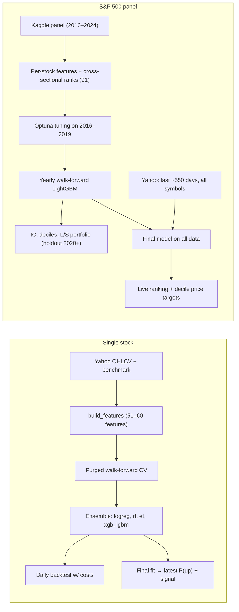
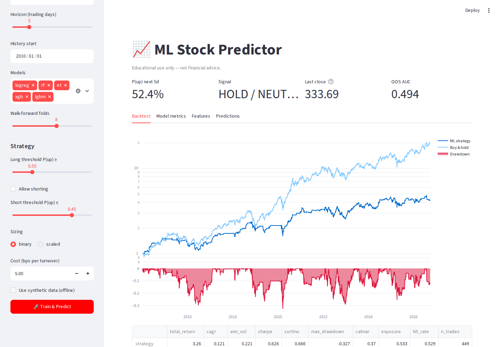
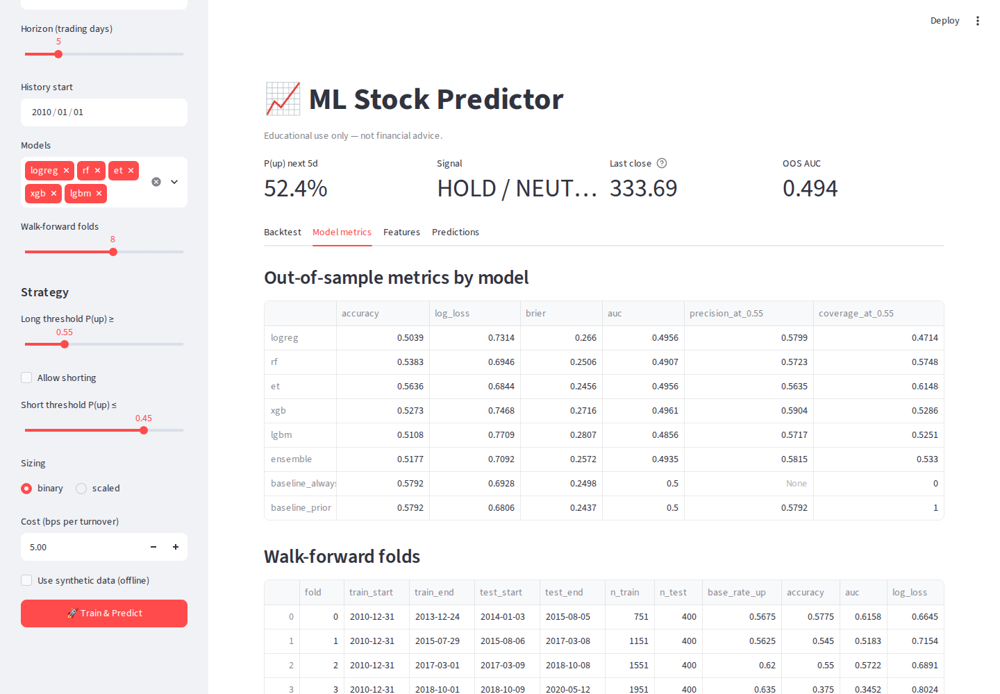
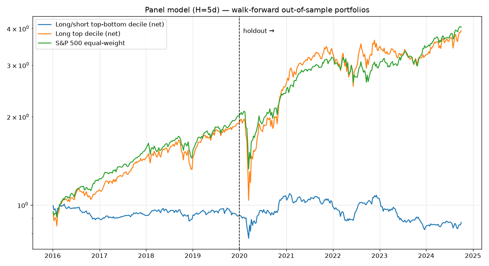
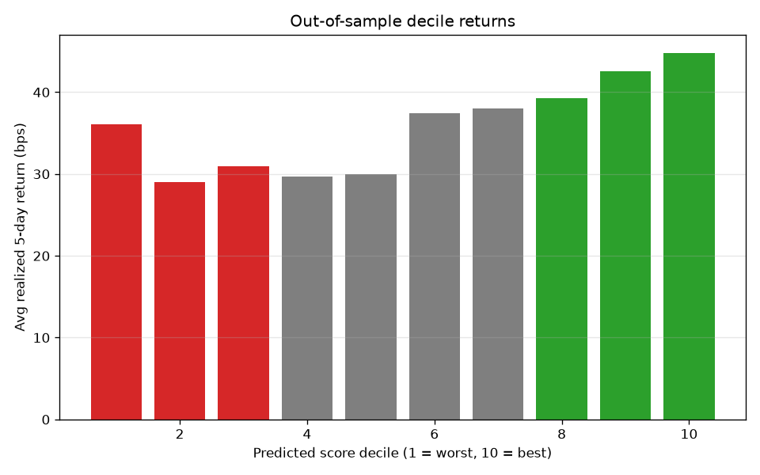

# 📈 Stock Prediction System: LightGBM Panel Model and Ensemble Classifiers

A research codebase for forecasting short-horizon stock moves with machine learning, built around honest out-of-sample evaluation. It has two workflows:

1. **S&P 500 cross-sectional panel model.** One LightGBM model trained on ~1.67M stock-days from ~500 S&P 500 companies. It ranks every stock by its chance of beating the median stock over the next *H* trading days.
2. **Single-stock ensemble.** A soft-voting ensemble (Logistic Regression, Random Forest, Extra Trees, XGBoost, LightGBM) that predicts whether one ticker will be up over the next *H* days.

Both use causal features, purged walk-forward validation, and backtests with transaction costs. A CLI and a Streamlit dashboard sit on top.

> [!WARNING]
> **Educational / research use only. This is not financial advice.** Short-horizon returns are close to random. The results measured below show the models have little or no reliable edge; see [Measured results](#-measured-results).

---

## ✨ Features

| Area | What is implemented |
|---|---|
| **Data** | Daily OHLCV from Yahoo Finance (`yfinance`, cached as CSV in `data/`); the Kaggle dataset [`andrewmvd/sp-500-stocks`](https://www.kaggle.com/datasets/andrewmvd/sp-500-stocks) pinned to version 950 (2010-01-04 → 2024-10-10, 498 symbols after filtering), cached as Parquet; a synthetic GARCH-like price generator for offline use and tests. |
| **Features** | 51 causal technical features per stock (returns, volatility, moving-average distance, MACD, RSI, stochastics, CCI, Bollinger, ATR/ADX, volume/OBV/MFI, skew/kurtosis, 52-week range, calendar) plus 9 market-context features when a benchmark is used (60 total). The panel adds liquidity features, cross-sectional percentile ranks, sector-relative returns and a sector code (91 features). |
| **Targets** | Single stock: forward *H*-day return > threshold (default 0). Panel: forward *H*-day return above that day's cross-sectional median; LightGBM is trained on the forward-return rank (regression) or this binary label, chosen by tuning. |
| **Validation** | Single stock: expanding-window walk-forward with a purge gap of *H* rows. Panel: yearly walk-forward re-training from 2016 with an *H*-day purge; Optuna tuning only on 2016–2019; 2020+ is a holdout. |
| **Metrics** | Accuracy, AUC, log loss, Brier, precision/coverage at P ≥ 0.55, naive baselines (single stock); Information Coefficient (mean, IR, overlap-adjusted t-stat), decile returns, price-target MAPE (panel). |
| **Backtests** | Single stock: daily long/flat (optionally short) strategy with costs vs buy-and-hold. Panel: non-overlapping *H*-day rebalanced long/short top-vs-bottom decile and long-only top decile, net of costs, vs the equal-weight universe. |
| **Interfaces** | CLI (`train`, `predict`, `scan`, `panel-train`, `panel-predict`) and a Streamlit dashboard (`app.py`). |

---

## 🧱 Architecture



### Project structure

```
main.py                    CLI entry point
app.py                     Streamlit dashboard
stock_predictor/
  config.py                Config dataclass (single-stock workflow)
  data.py                  Yahoo download + CSV cache, synthetic prices
  features.py              Causal feature engineering, targets, Dataset
  models.py                Model zoo + soft-voting EnsembleClassifier (joblib persistence)
  validation.py            Purged walk-forward splits and metrics
  backtest.py              Vectorized daily backtest with costs
  pipeline.py              run_training / predict_latest
  plots.py                 Single-stock report charts
  kaggle_data.py           Kaggle panel download/cleaning, Yahoo bulk refresh
  panel.py                 Panel features, tuning, walk-forward, portfolio backtest, live ranking
tests/                     pytest suite (offline, synthetic data)
```

---

## 🚀 Installation

Requires Python 3.10+.

```bash
python3 -m venv .venv
source .venv/bin/activate
pip install -r requirements.txt
```

No API keys are needed. The Kaggle dataset downloads anonymously through `kagglehub` (a 44.5 MB archive, ~190 MB extracted, cached in `~/.cache/kagglehub`). Yahoo Finance needs internet access.

---

## 🧪 Usage

### Offline demo (no network)

```bash
python main.py train   --ticker DEMO --synthetic
python main.py predict --ticker DEMO --synthetic
```

### Single stock

```bash
python main.py train   --ticker AAPL --horizon 5
python main.py predict --ticker AAPL --horizon 5 --json
python main.py scan    --tickers AAPL MSFT NVDA --models logreg rf --no-plots
```

Non-US tickers use Yahoo suffixes, e.g. `RELIANCE.NS --market ^NSEI`. `predict` must use the same `--market` setting as `train`, since the model expects the same feature set.

| Option | Default | Description |
|---|---|---|
| `--ticker` / `--tickers` | required | Symbol (`train`, `predict`) or symbols (`scan`) |
| `--horizon` | `5` | Predict direction over the next N trading days |
| `--start` / `--end` | `2010-01-01` / today | History window |
| `--market` | `SPY` | Benchmark for context features (`none` to disable) |
| `--models` | `logreg rf et xgb lgbm` | Any subset of base models |
| `--splits` | `8` | Walk-forward folds |
| `--long-threshold` | `0.55` | Go long when P(up) ≥ this |
| `--short-threshold` | `0.45` | Short (if allowed) when P(up) ≤ this |
| `--allow-short` | off | Enable short positions |
| `--sizing` | `binary` | `binary` (all-in/out) or `scaled` (by confidence) |
| `--cost-bps` | `5` | Cost per unit of turnover in basis points |
| `--synthetic` | off | Use generated prices instead of Yahoo |
| `--no-plots`, `-v` | off | Skip charts / verbose logging |
| `--json` | off | `predict` only: JSON output |

### S&P 500 panel model

```bash
python main.py panel-train   --horizon 5 --tune-trials 25   # 0 skips Optuna and uses the default params
python main.py panel-predict --horizon 5                    # refreshes ~550 days of prices from Yahoo
python main.py panel-predict --horizon 5 --no-refresh --json # score the last Kaggle date instead
```

Runtime on a 4-core / 16 GB machine with `--tune-trials 0` was 7m23s (feature build 41s). Optuna tuning adds a multiple of that per trial.

`panel-predict` prints the top and bottom 10 stocks. Each row has a score decile, `signal` (top decile = STRONG BUY, 8–9 = BUY, 2–3 = SELL, bottom = STRONG SELL), `prob_beat_median` and `prob_up` (the out-of-sample rates, for that decile, of beating the median stock and of rising at all), `exp_return`, and `target_price` / `low_10` / `high_90` (close × the decile's mean and 10th/90th-percentile historical forward return).

### Dashboard

```bash
streamlit run app.py
```

The sidebar switches between **S&P 500 Panel (Kaggle)** mode, which trains the panel model with 3 Optuna trials and shows holdout IC and portfolio metrics, and **Single Stock** mode, which shows P(up), signal, OOS AUC and tabs for the backtest, per-model metrics, walk-forward folds, feature importance and recent OOS predictions. Results are cached by settings while the server runs.

Single-stock mode, real AAPL data (captured 2026-10-04):





---

## 💾 Outputs

| Workflow | Path | Contents |
|---|---|---|
| Single stock | `models/<TICKER>_h<H>.joblib` | Fitted ensemble + metadata (config, OOS metrics, backtest) |
| | `reports/<TICKER>_h<H>/metrics.json` | Classification + backtest metrics and run metadata |
| | `oos_predictions.csv` | Per-day OOS probability per model, label, returns, fold |
| | `backtest.csv`, `folds.csv` | Positions/returns/equity/drawdown; per-fold dates and scores |
| | `feature_importance.csv/.png`, `equity_curve.png`, `calibration.png` | Charts (skipped with `--no-plots`) |
| Panel | `models/panel_h<H>.txt`, `panel_h<H>_meta.json` | LightGBM booster; features, sectors, params, decile map, metrics |
| | `reports/panel_h<H>/metrics.json` | Validation and holdout metrics, params, tuning summary, runtime |
| | `oos_predictions.parquet`, `per_year.csv`, `deciles.csv` | OOS scores, per-year IC/AUC/returns, decile table |
| | `portfolio_backtest.csv`, `optuna_trials.csv` | Rebalance-level portfolio returns; tuning trials (if tuned) |
| | `portfolio_equity.png`, `decile_returns.png`, `rolling_ic.png`, `feature_importance.png/.csv` | Charts |
| | `live_predictions_<DATE>.csv` | Written by `panel-predict` |

---

## 📊 Measured results

These numbers come from real runs on 2026-10-04 in this repository's code, not from tuning for a good-looking chart. Your numbers will differ with dates, data and settings.

**Panel model, H = 5, default parameters (`--tune-trials 0`), Kaggle v950:**

| Period | AUC | Mean IC | IC t-stat | Long/short net CAGR | Long top decile CAGR | Equal-weight universe CAGR |
|---|---|---|---|---|---|---|
| Validation 2016–2019 | 0.506 | 0.012 | 0.91 | −2.0% | 17.5% | 19.2% |
| Holdout 2020-01 → 2024-10 | 0.508 | 0.013 | 0.86 | −2.2% | 13.7% | 15.7% |

The IC is positive but not statistically significant, and after 5 bps costs the long/short portfolio lost money in both periods. The decile price targets had essentially the same error as "price unchanged" (holdout MAPE 3.512% vs 3.515%).





**Single stock, AAPL, H = 5, all five models, 2010-01-01 → 2026-10-02:** ensemble OOS accuracy 52.1% and AUC 0.493, below the always-up baseline (57.9% accuracy). The long/flat strategy returned +322% with Sharpe 0.62 against +1922% and Sharpe 0.98 for buy-and-hold.

**How to judge a model honestly:**
* An AUC steadily above ~0.52 across folds suggests a small real edge; around 0.50 means none.
* Compare accuracy with `baseline_always_up`. Stocks rise more often than they fall.
* Prefer Sharpe and max drawdown over total return, and check that fold or per-year results are consistent.

---

## ✅ Testing

```bash
pip install -r requirements.txt ruff
pytest -q        # 11 tests, offline, ~30 s
ruff check .
```

The suite checks feature causality (truncating future prices leaves past features unchanged), dataset shapes, purge gaps, backtest cost accounting, an end-to-end synthetic single-stock run, an end-to-end panel train + predict on a 24-symbol synthetic panel, the dashboard's panel mode (Streamlit `AppTest`), and the regressions listed below. GitHub Actions runs lint and tests on Python 3.10–3.12.

---

## 🛠 Fixed in the 2026-10 audit

* **Dashboard panel mode crashed** with `name 'asdict' is not defined` when you clicked Train & Predict (missing import in `app.py`). The Single Stock market-ticker input was also shadowed by a duplicate widget.
* **`panel-train` failed on a fresh install**: `optuna` and `kagglehub` were not in `requirements.txt` (`pyarrow` is now listed explicitly too).
* **`prob_beat_median` was mislabeled**: it held each decile's rate of *any* price rise, not of beating the median. In the real run the bottom decile showed 0.548 although its true beat-median rate was 0.493. It now uses the right rate, and `prob_up` carries the absolute one. Panel models trained before this fix show `prob_beat_median` as empty until retrained.
* **`--synthetic` train and predict used different data**: the seed came from Python's per-process salted `hash()`, so `predict --synthetic` scored a different random series than `train --synthetic`. It now uses a stable CRC32 seed.
* **`predict` with a different `--market` than training** failed with a bare `KeyError`; it now explains which features are missing.
* Added CI (ruff + pytest), a ruff config and tests for all of the above.

---

## ⚠️ Known limitations

* The measured edge is small and statistically weak (see above). Don't trade on it.
* **Stale, survivorship-biased universe.** The panel uses the S&P 500 membership of the 2024 Kaggle snapshot for all years. `panel-predict` downloads those same symbols, so names that have since been delisted or merged are dropped (yfinance reports them as "possibly delisted") and newer index members are missing.
* `target_price` is the close plus the decile's *historical mean* return, which was positive in every decile, so even STRONG SELL rows can have a target above the current price.
* Single-stock backtests assume fills at the close and a flat cost, with no slippage, taxes or borrow fees. Yahoo data is free but not exchange-grade.
* The dashboard's panel mode retrains the full model (3 Optuna trials) on each new setting, which takes many minutes.

## 🔭 Ideas to extend

* New features: add columns in [`build_features`](stock_predictor/features.py), keep them causal, run `pytest`.
* New models: add a branch in [`make_model`](stock_predictor/models.py).
* Weighted ensemble: `EnsembleClassifier(..., weights={"xgb": 2})`.
* Point-in-time index membership to remove survivorship bias from the panel.

## 📄 License

The project was described as MIT-licensed, but no `LICENSE` file is included yet; add one to make the terms explicit.
